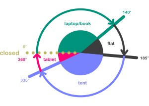

title: Angular apps for dual-screen devices with ngx-foldable
class: animation-fade
layout: true

.twitter-handle[
  @sinedied
]

<!--

Celui la c'est pour mon meetup Angular ;)

# Historique(s) 2min - Yohan
- Web/RD + GameWatch/Nintendo DS
* From desktop first to mobile first
* demain? foldavle first?

# Etat de l'art: c'est pas sec 2min - Olivier
* Window Segment + CSS primitives
* Device Posture
+ question dev

# Comment on dev? 10min - Yohan
- Tools/emulateurs + SETUP EMULATOR
- Polyfills / CS JSS
- Problemes
+ question dev

# NGX foldable/React 10min - Yohan
- Demo gallery app

-->

---

class: left, middle, hide-handle, primary, overlay-dark
background-image: url(./images/duo-banner.jpg)

# .light-text[Angular apps for dual-screen devices]
## with ngx-foldable

.full-layer.light-text.space-left[
  .w-10.responsive[] Angular Nation
]

.full-layer.who.text-right.small.middle.light-text[
  .ms.responsive[]
  |
  Yohan Lasorsa
  |
  @sinedied
]

???

Commentaire

---

class: middle, center, hide-handle
# .large[Who am I?]

.table.row.middle[
.col-4.center[
  .w-70.responsive.avatar.tada.animated[]
]
.col-8.bit-larger.left[
  .e[Yohan Lasorsa]<br>
  .bit-larger[\[ Cloud Developer Advocate .mini-img[] \]]<br>
  .small.em-text[Web tech geek, OSS maintainer, DIY lover]<br>
]
]
.center.bit-larger[
.large.em-text[{]
.fab.fa-twitter[] .fab.fa-github[] .fab.fa-dev[]
.large.em-text[}] .e[@sinedied]<br>
]

???

ca fait plus de 10 ans que je baigne dans le monde du web...
je ne vais pas vous refaire tout l'historique, car simplement...

---

class: impact
## .large[Dual screen devices?]

---

class: contain, middle
background-image: url(./images/gw.jpg)

--
# .large[1982]

---

class: contain, middle
background-image: url(./images/ds-fat.jpg)

???
tactile!

--
# .large[2004]

---

class: contain, middle
background-image: url(./images/3ds.jpg)

--
# .large[2010]

???
3DS: 2010, has web browser!

---

class: contain
background-image: url(./images/duo.jpg)

???
2020

---

background-image: url(./images/new-devices-dual.jpg)

---

class: full, middle, center, overlay-dark
background-image: url(./images/experimental.jpg)

# .large[⚠️]
# Experimental APIs ahead

---

# CSS Primitives
### [aka.ms/foldable/css-primitives](https://aka.ms/foldable/css-primitives)<br>[aka.ms/docs/css-primitives](https://aka.ms/docs/css-primitives)

.center[
.w-60.responsive[]
]

---

# CSS Primitives

.center[
.w-60.responsive[]
]

---

# Window Segments API
### [aka.ms/foldable/window-segments](https://aka.ms/foldable/window-segments)<br>[aka.ms/docs/window-segments](https://aka.ms/docs/window-segments)

```js
const screenSegments = window.getWindowSegments();

if (screenSegments.length > 1) {
  // The device is a foldable!
  for (let i = 0; i < screenSegments.length; i++) {
    console.log(`Screen segment ${i}:`);
    console.log('- width   : ' + screenSegments[i].width);
    console.log('- height  : ' + screenSegments[i].height);
    console.log('- x origin: ' + screenSegments[i].x);
    console.log('- y origin: ' + screenSegments[i].y);
  }
}
```

---

# Device Posture API
### [w3.org/TR/device-posture/](https://w3.org/TR/device-posture/)

.full-layer.right.space-right[
.w-30.responsive[]
]

- **Device**: single-screen (foldable or not), dual-screen
- **Posture**: no-fold, laptop, flat, tent, tablet, book

.center[
.w-70.responsive[]
]

---

class: impact, alt
## .large[Demos]

???

- ngx-foldable demo
- gallery app
- battleship

---

class: impact
## .large[Setting up for development]

---

# Enable browser dual-screen emulation
### https://aka.ms/foldable/dev-setup

1. `chrome://flags` or `edge://flags`
2. Enable **Experimental Web Platform features**
3. Open dev tools settings
4. In **Experiments** tab, tick **Emulation: Support dual screen mode**

.center[
  .w-70.responsive[]
]

---

# Android Surface Duo emulator
### https://aka.ms/foldable/dev-setup

.center[
  .w-50.responsive[]
  ### ⚠️ *Highly recommended!*
]

---

class: full, bottom, center
background-image: url(./images/dive.jpg)

# Let's dive in!

???

- ngx-foldable github page
- Gallery app source code

---

class: middle, hide-handle

.big-text.no-bg.baseline[
```js
const end = {
  message: 'Thank you!',
  slides : 'bit.ly/ngx-foldable',
  links  : 'aka.ms/ngx-foldable'
};

alert('Questions?');
```
]

<hr class="hr-right more-space">
.right.large[
.large.em-text[{]
.fab.fa-twitter[] .fab.fa-github[] .fab.fa-dev[]
.large.em-text[}] .e[@sinedied]<br>
]
